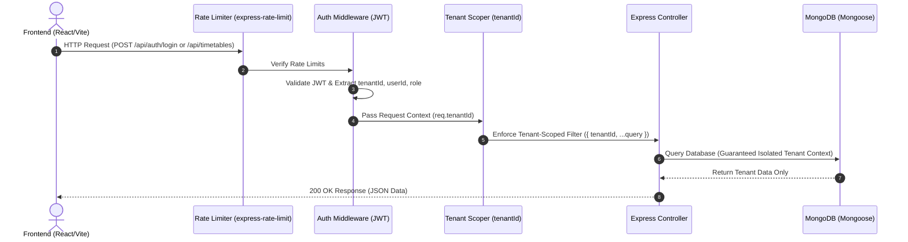

# ScheduleAI — Multi-Tenant Academic Scheduling SaaS

**ScheduleAI** is a multi-tenant academic timetable SaaS platform built for educational institutions. Colleges sign up as isolated tenants to manage faculty, room capacity, sections, and automated timetable generation with strict data isolation, role-based access control (RBAC), and monthly usage metering.

---

## 🏗️ Architecture & Request Flow



---

## Key Features

- **Strict Multi-Tenant Isolation**: Compound database indexing and query-scoping middleware enforce `tenantId` boundaries on all Mongoose models (`User`, `Faculty`, `Room`, `Section`, `Timetable`, `UsageLog`, `Invitation`).
- **JWT & Role-Based Access Control (RBAC)**: JWT tokens carry `{ userId, tenantId, role }`. Granular permissions enforced via backend middleware across four roles: `owner`, `admin`, `faculty`, and `student`.
- **Institution Onboarding & Email Invitations**: Institution signup automatically initializes a new `Tenant` document and sets the initial user as `owner`. Owners and Admins can invite team members with role assignments.
- **Monthly Usage Metering**: Monthly timetable generation limits (Free: 3/mo, Pro: 100/mo, Enterprise: 1000/mo) tracked via a `UsageLog` collection. Returns clean HTTP 403 Forbidden payloads when limits are reached.
- **Backtracking Constraint Solver**: Hybrid constraint-aware scheduling engine handling room capacity, section overlaps, teacher availability, and practical lab session scheduling.
- **Security & Rate Limiting**: Password hashing using `bcrypt` (12 salt rounds) and request rate-limiting on authentication endpoints via `express-rate-limit`.
- **Automated Testing & CI/CD**: Automated unit/integration isolation tests, 30-request concurrent load benchmark with structured output metrics, and GitHub Actions CI workflow.

---

## Tech Stack

- **Frontend**: React (Vite), Tailwind CSS, Axios, Lucide Icons, jsPDF, XLSX
- **Backend**: Node.js, Express 5, MongoDB, Mongoose 9, JWT, bcryptjs, express-rate-limit
- **Testing**: Node Test Runner, Supertest, MongoDB Memory Server
- **DevOps**: Docker, Docker Compose, GitHub Actions

---

## Data Model & Tenant Isolation Architecture

Every tenant-owned document inherits the `tenantId` field via a reusable Mongoose plugin:

```text
               ┌────────────────────────┐
               │    Tenant Document     │
               │ (id, name, slug, plan) │
               └───────────┬────────────┘
                           │
       ┌───────────────────┼───────────────────┐
       ▼                   ▼                   ▼
┌──────────────┐   ┌──────────────┐   ┌─────────────────┐
│ User Schema  │   │ Room Schema  │   │ Timetable Model │
│ (tenantId,   │   │ (tenantId,   │   │ (tenantId,      │
│  email, role)│   │  name, cap)  │   │  assignments)   │
└──────────────┘   └──────────────┘   └─────────────────┘
```

### RBAC Matrix

| Role | Manage Institution | Invite Users | Create/Edit Resources | Generate Timetables | View Timetables |
| :--- | :---: | :---: | :---: | :---: | :---: |
| **owner** | ✅ | ✅ | ✅ | ✅ | ✅ |
| **admin** | ❌ | ✅ | ✅ | ✅ | ✅ |
| **faculty** | ❌ | ❌ | ❌ | ❌ | ✅ |
| **student** | ❌ | ❌ | ❌ | ❌ | ✅ |

---

## Getting Started

### Option 1: Docker Compose (Recommended 1-Command Startup)

Run the full stack (MongoDB + Backend + Frontend) using Docker:

```bash
docker-compose up --build
```
- Frontend: `http://localhost:5173`
- Backend API: `http://localhost:4000`

---

### Option 2: Manual Local Setup

#### Prerequisites
- Node.js (v18+)
- MongoDB (running locally on `mongodb://127.0.0.1:27017` or via URI)

#### Installation

1. **Clone the repository**:
   ```bash
   git clone https://github.com/SyedSehran/Multi-tenant-Schedule-AI.git
   cd Multi-tenant-Schedule-AI
   ```

2. **Backend Setup**:
   ```bash
   cd backend
   npm install
   npm run dev
   ```

3. **Frontend Setup**:
   ```bash
   cd ../frontend
   npm install
   npm run dev
   ```

---

## API Documentation

A Postman API Collection is included under `docs/postman_collection.json`. Import this file into Postman to test auth, onboarding, invitation, dashboard, and timetable endpoints.

---

## Running Automated Tests & Concurrency Benchmarks

The project includes an automated test suite verifying tenant isolation and concurrent request safety under load:

```bash
cd backend
npm test
```

### Sample Concurrency & Isolation Benchmark Output

```text
==================================================
 CONCURRENCY & TENANT ISOLATION BENCHMARK RESULTS 
==================================================
  Total Concurrent Requests : 30
  Total Execution Time      : 184 ms
  Average Latency / Request : 6.13 ms
  Zero-Leak Isolation Pass  : 30 / 30 (100.0%)
  HTTP Status Distribution  : {"200":15,"404":15}
==================================================

✔ Concurrent cross-tenant isolation and load benchmark (30 simultaneous requests)
✔ Tenant A cannot fetch Tenant B timetable with Tenant A token
```

---

## CI/CD Workflow

A GitHub Actions workflow is located at `.github/workflows/test.yml`. It automatically provisions a MongoDB service container, installs dependencies, and runs the test suite on every `push` and `pull_request` to `main`.

---

## License

MIT License
